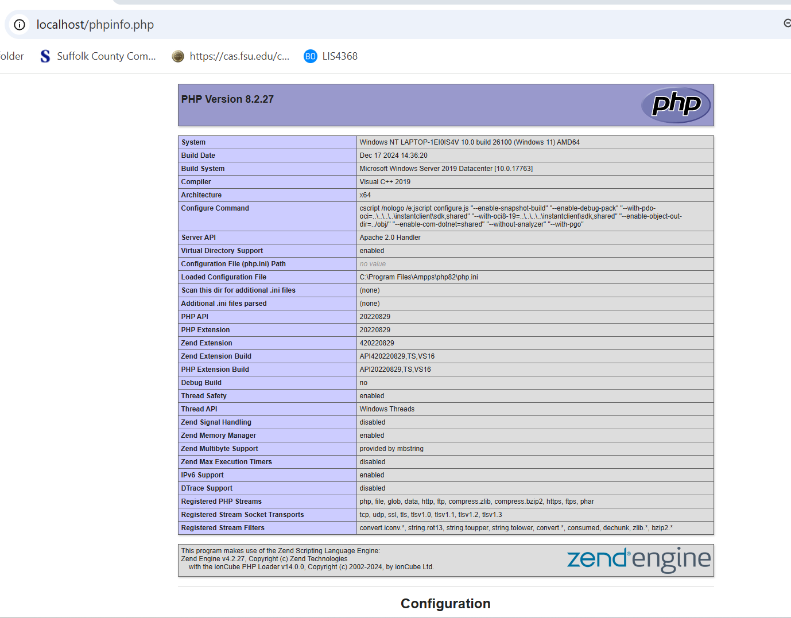
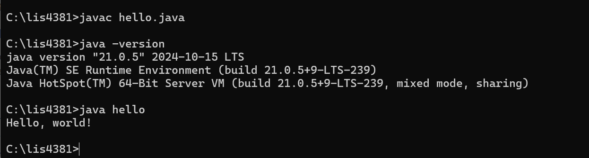

# LIS4381 Mobile Web Application Development
## Brennan O'Halloran

# Assignement 1 Requirements:

Three Parts:

1. Set up bitbucket account and connect it to you local machine.
2. Distributive version control with Git and BitBucket.
3. Install necessary software.

#### README.md file should include the following items:

* Screenshot of Ampps   
* Screenshot of running java Hello
* Screenshot of running Andriod Studio first app
* Git commands w/short descriptions

> #### Git commands w/short descriptions:

1. git init - Create an empty Git repository or reinitialize an existing one
2. git status - Show the working tree status
3. git add - Add file contents to the index
4. git commit - Record changes to the repository
5. git push - Update remote refs along with associated objects
6. git pull - Fetch from and integrate with another repository or a local branch
7. git clone - Clone a repository into a new directory

#### Assignment Screenshots:

*Screenshot of AMPPS running My PhP Installation*:

*Screenshot of running java Hello*:

*Screenshot of Andriod Studion-My first app*:

