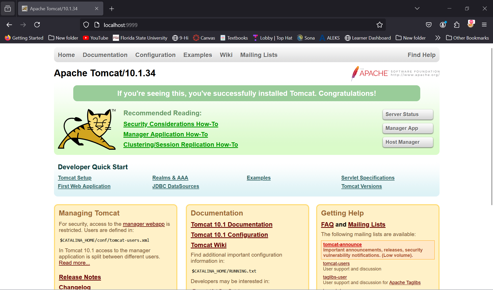
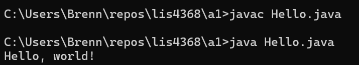
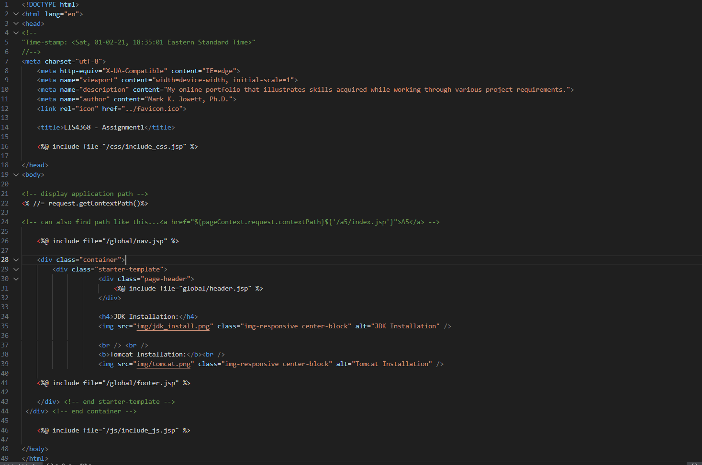
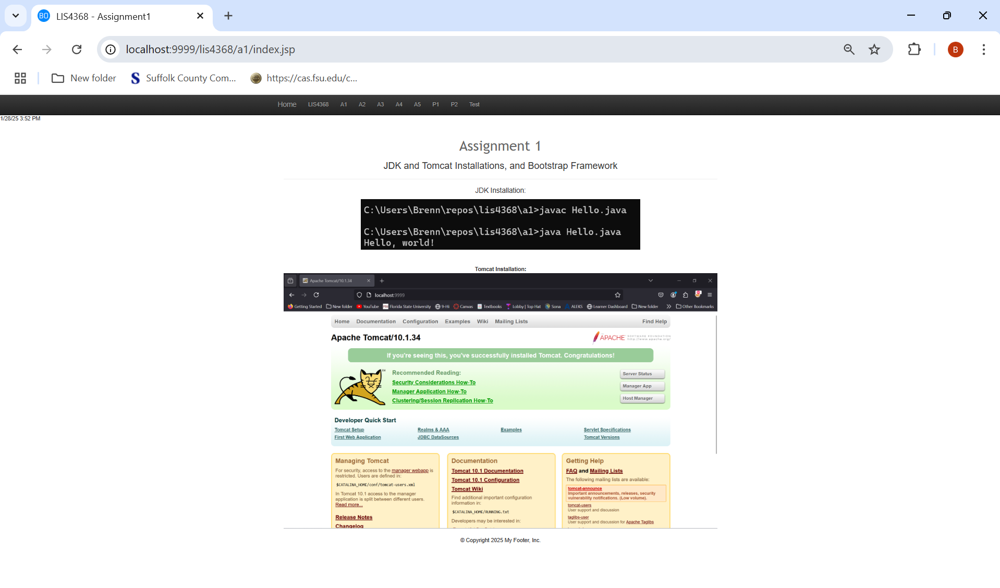

# LIS4368 Advanced Web Application Development

## Brennan O'Halloran

# Assignemnt 1 Requirements:

Three Parts:

1. Set up bitbucket account and connect it to you local machine.
2. Distributive version control with Git and BitBucket.
3. Install necessary software.

#### README.md file should include the following items:

* Screenshot of running java Hello
* Screenshot of running http://localhost:9999
* Git commands w/short descriptions
* Screenshot of a1/index.jsp

> #### Git commands w/short descriptions:

1. git init - Create an empty Git repository or reinitialize an existing one
2. git status - Show the working tree status
3. git add - Add file contents to the index
4. git commit - Record changes to the repository
5. git push - Update remote refs along with associated objects
6. git pull - Fetch from and integrate with another repository or a local branch
7. git clone - Clone a repository into a new directory

#### Assignment Screenshots:

*Screenshot of AMPPS running http://localhost*:

*Screenshot of running java Hello*:

*Screenshot of a1/index.jsp*:

*Screenshot of a1/index.jsp running*:

#### Tutorial Links:

*Bitbucket Tutorial - Station Locations:*
[A1 Bitbucket Station Locations Tutorial Link](https://bitbucket.org/username/bitbucketstationlocations/ "Bitbucket Station Locations")

*Tutorial: Request to update a teammate's repository:*
[A1 My Team Quotes Tutorial Link](https://bitbucket.org/username/myteamquotes/ "My Team Quotes Tutorial")