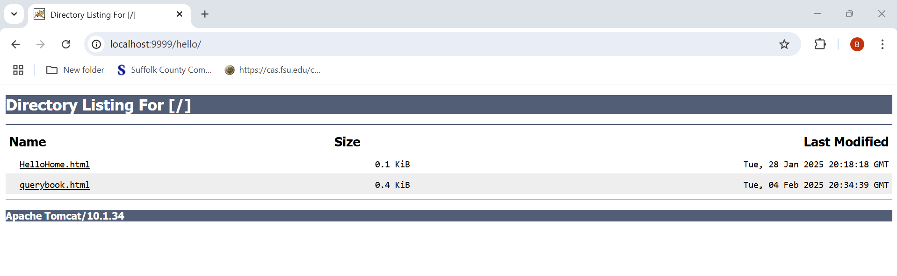
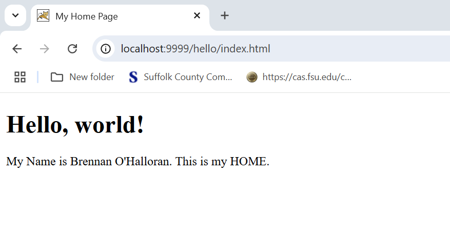
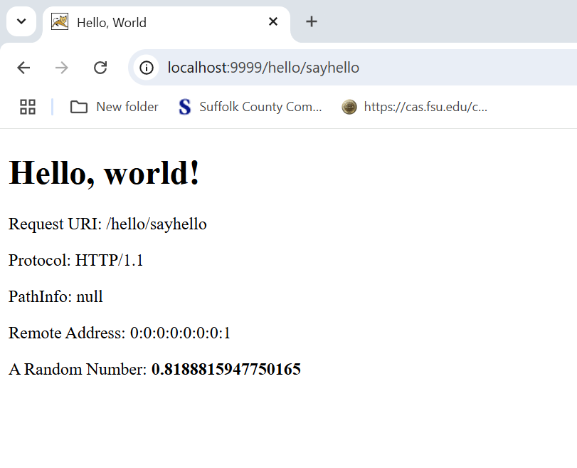
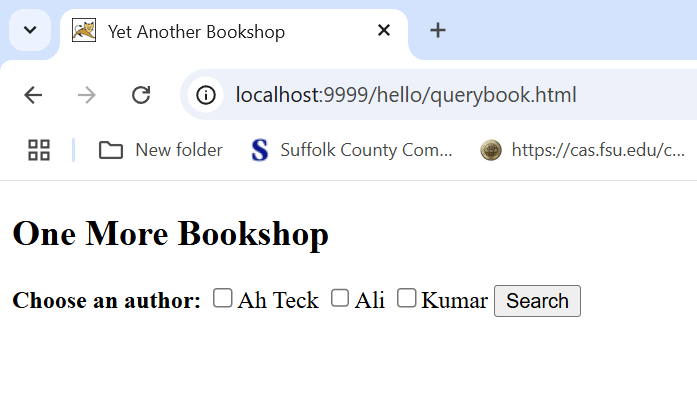
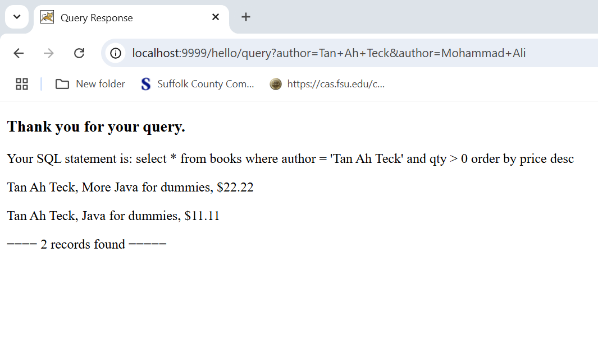
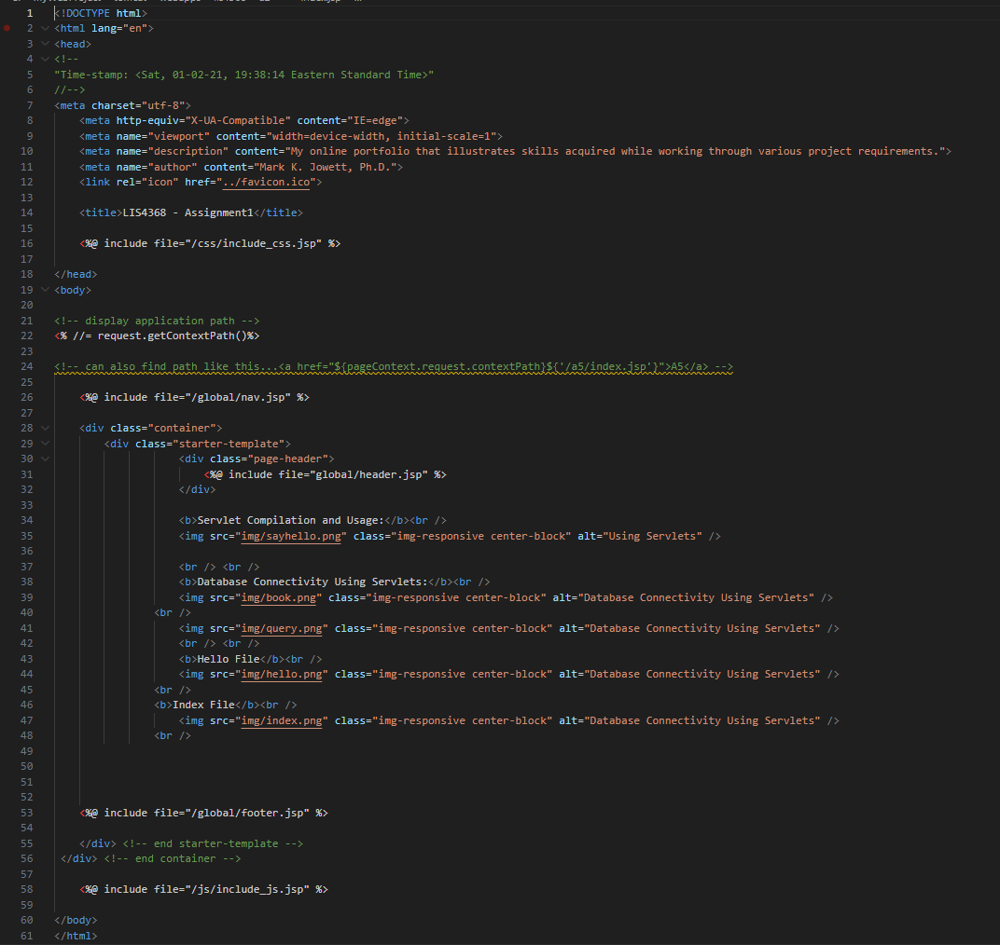

# LIS4368 Advanced Web Application Development

## Brennan O'Halloran

# Assignemnt 2 Requirements:

Four Parts:

1. Install mySQL workbench if you don't already have it.
2. Follow the servlet tuutorial to create a simple servlet..
3. Compile and run the servlet.
4. Make sure each link displays the correct information.

#### Assessment Links: 
* http://localhost:9999/hello
* http://localhost:9999/hello/HelloHome.html
* http://localhost:9999/hello/sayhello
* http://localhost:9999/hello/querybook.html

#### README.md file should include the following items:

* Assessment links (as above)
* Screenshot of querybook.html 
* Screenshot of the query results
* Screenshot of and a2/index.jsp file 

#### Assignment Screenshots:

*http://localhost:9999/hello*:

*http://localhost:9999/hello/index.html*:

*http://localhost:9999/hello/sayhello*:

*http://localhost:9999/hello/querybook.html*:

*Query Results Screenshot*:

*a2/index.jsp Screenshot*:

| *Screenshot skillset 1*:    |  *Screenshot of skillset 2*:   | *Screenshot skillset 3*:  |
|------------|------------|------------|
|      |  | |

