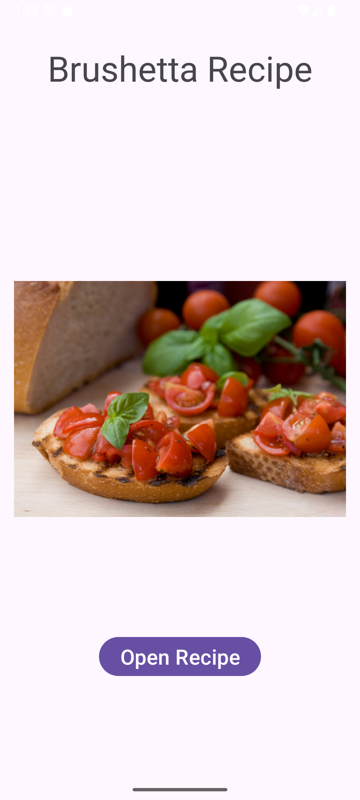
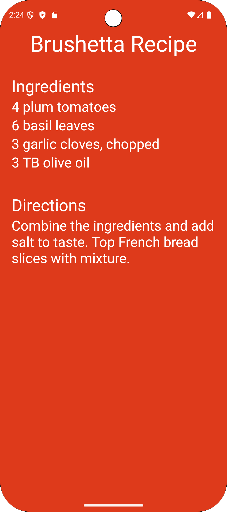
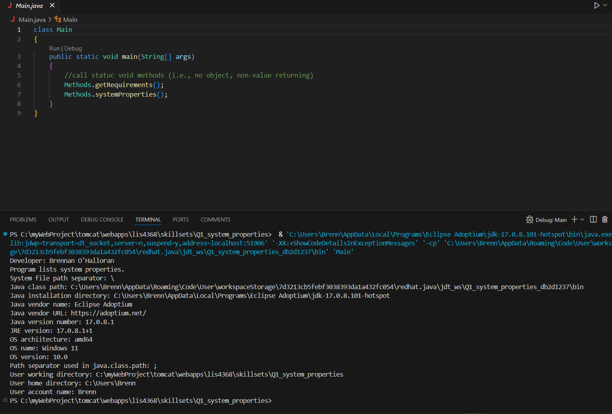
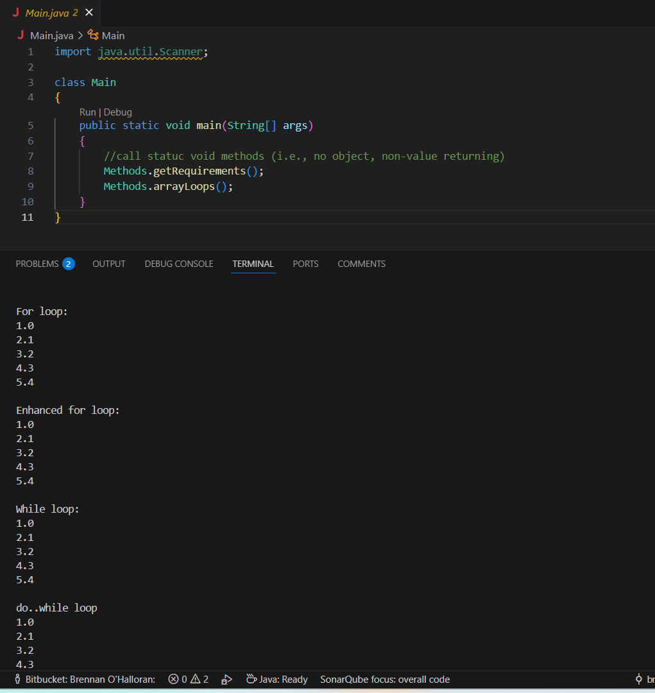
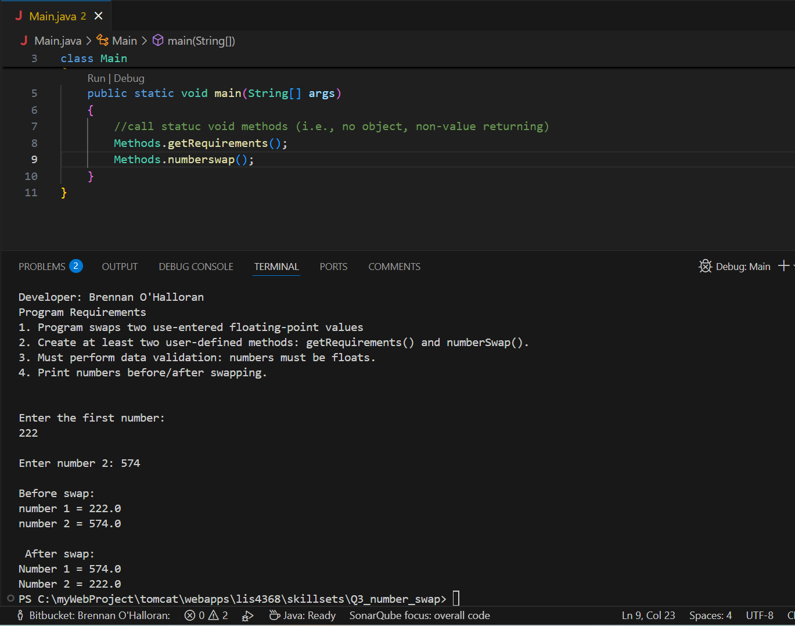

# LIS4381 Mobile Web Application Development

## Brennan O'Halloran

# Assignement 2 Requirements:

Four Parts:

1. Complete all necessary programming for the HealthyRecipies app
2. Take a screenshot of the first page
3. Take a screenshot of the second page
4. Include Skillsets

#### README.md file should include the following items:

* Screenshot of running application’s first user interface
* Screenshot of running application’s second user interface
* Screenshots of each skillset

#### Assignment Screenshots:

| **Screenshot of running application’s first user interface*:    |  *Screenshot of running application’s second user interface*:   | 
|-------------------------------------|----------------------------------|
|      |  | 

| [Skillset 1](../skillsets/ss1_evenorodd/ "Open Skillset 1 folder") | [Skillset 2](../skillsets/ss2_largestnumber/ "Open Skillset 2 folder") | [Skillset 3](../skillsets/ss3_arrays_and_loops/ "Open Skillset 3 folder") |
|------------|------------|------------|
|  |  |  |

