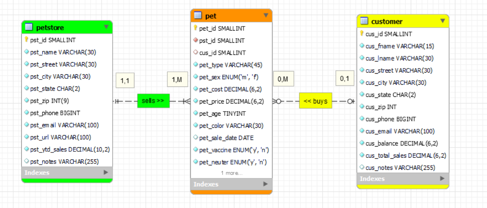
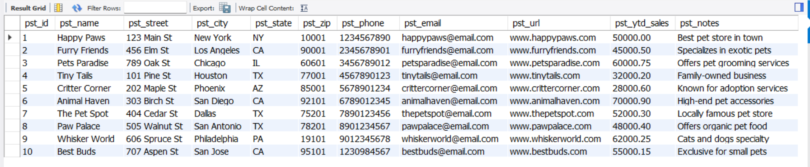
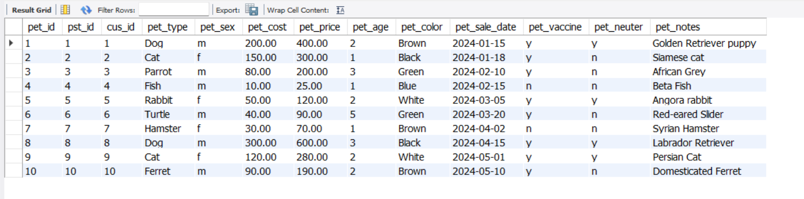
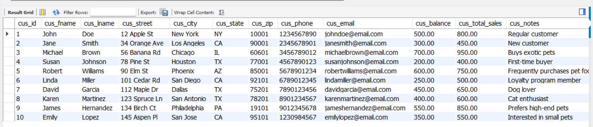
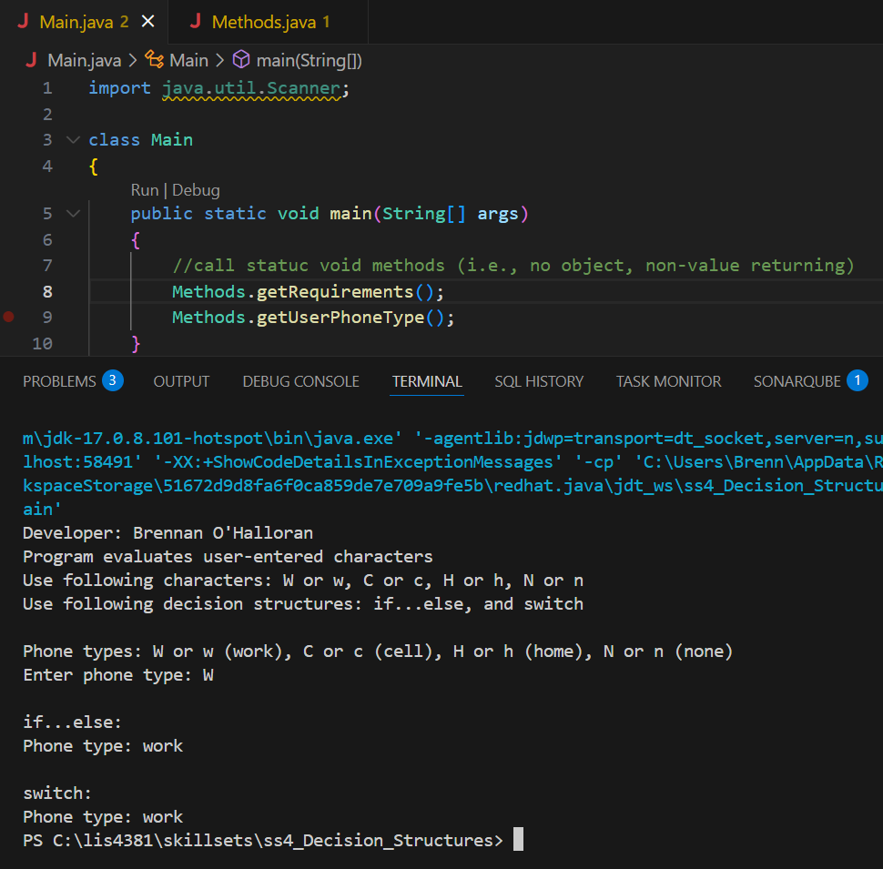
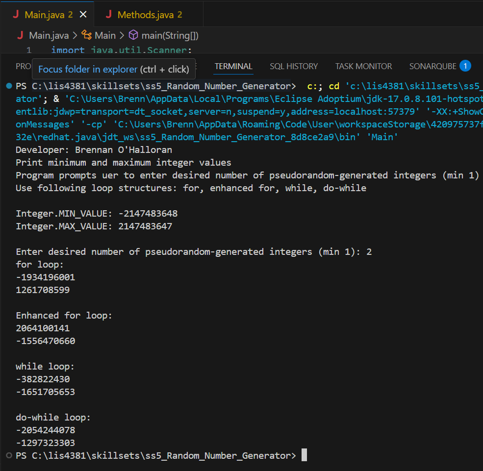
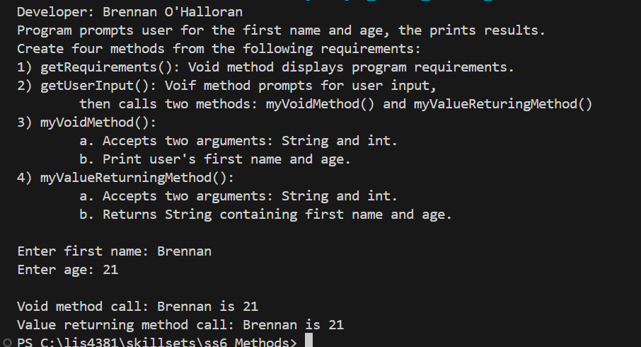

# LIS4381 Mobile Web Application Development

## Brennan O'Halloran

# Assignemnt 3 Requirements:

Four Parts:

1. Entity Relationship Diagram (ERD)
2. Include at least 10 records per table
3. Complete the required skillsets
4. Attach ERD and .SQL files
5. Complete and run the android application

#### README.md file should include the following items:
- Course title, your name, assignment requirements, as per A1;
- Screenshot of ERD;
- Screenshot of running application’s opening user interface;
- Screenshot of running application’s processing user input;
- Screenshots of 10 records for each table—use select * from each table;
- Links to the following files:
- a3.mwb
- a3.sql

#### Assignment Screenshots:

| **Screenshot of running application’s first user interface*:    |  *Screenshot of running application’s second user interface*:   | 
|-------------------------------------|----------------------------------|
|      |  | 

*ERD Screenshot*:

*Petstore records screenshot*:

*Pet records screenshot*:

*Customer records screenshot*:

*A3 ERD and SQL Files*:
[A3 MWB File](../a3/docs/a3.mwb "A3 ERD in .mwb format")
[A3 SQL File](../a3/docs/a3.sql "A3 SQL Script")

| [Skillset 4](../skillsets/ss4_Decision_Structures/ "Open Skillset 4 folder") | [Skillset 5](../skillsets/ss5_Random_Number_Generator/ "Open Skillset 5 folder") | [Skillset 6](../skillsets/ss6_Methods/ "Open Skillset 6 folder") |
|------------|------------|------------|
|  |  |  |

