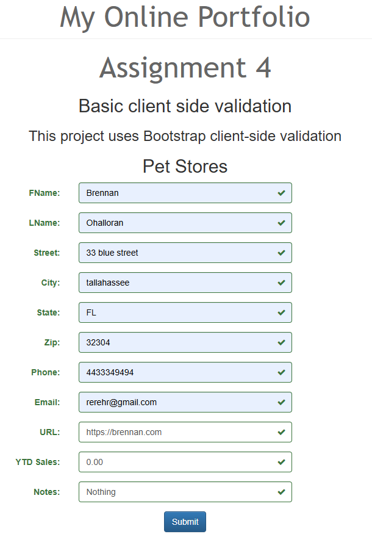
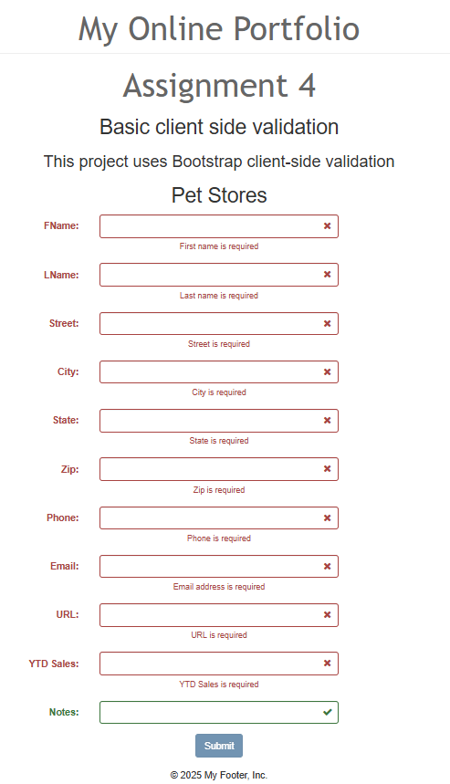
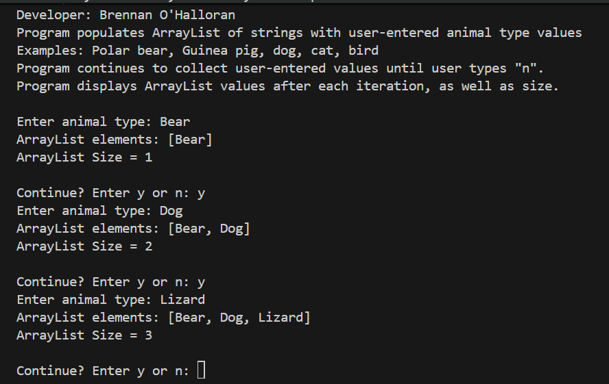
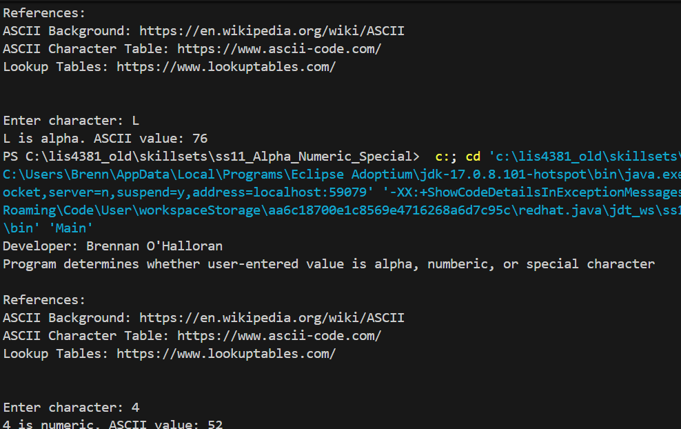
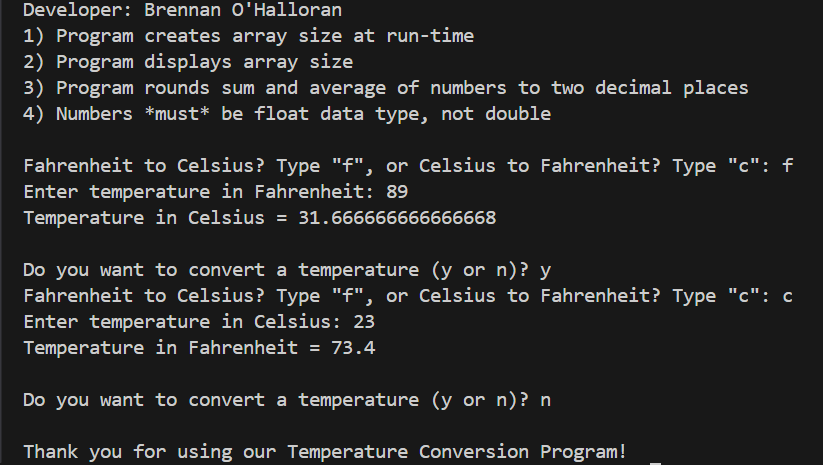

# LIS4368 Advanced Web Application Development

## Brennan O'Halloran

# Assignment 4 Requirements:

Four Parts:

1. Create and edit servlets and JSP pages
2. Screenshot of successful validation on form
3. Screenshot of failed validation on form
4. Complete the required skillsets

#### README.md file should include the following items:

 - Course title, your name, assignment requirements, as per A1
 - Screenshot failed validation on form
 - Screenshot of successful validation on form
 - Screenshot of skillset 10, 11, and 12
 - Link to local lis4381 web app: http://localhost/repos/lis4381_new/index.php

#### Assignment Screenshots:

*Home Page Screenshot*:

*Successful Validation Screenshot*:

*Failed Validation Screenshot*:

| *Screenshot skillset 10*:    |  *Screenshot of skillset 11*:   | *Screenshot skillset 12*:  |
|------------|------------|------------|
|      |  |  |

