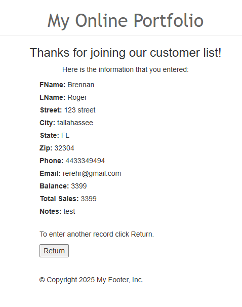
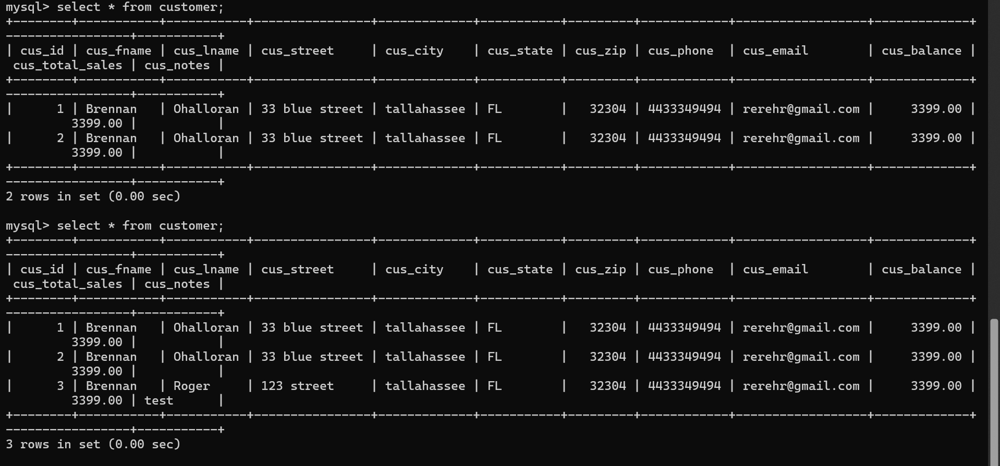
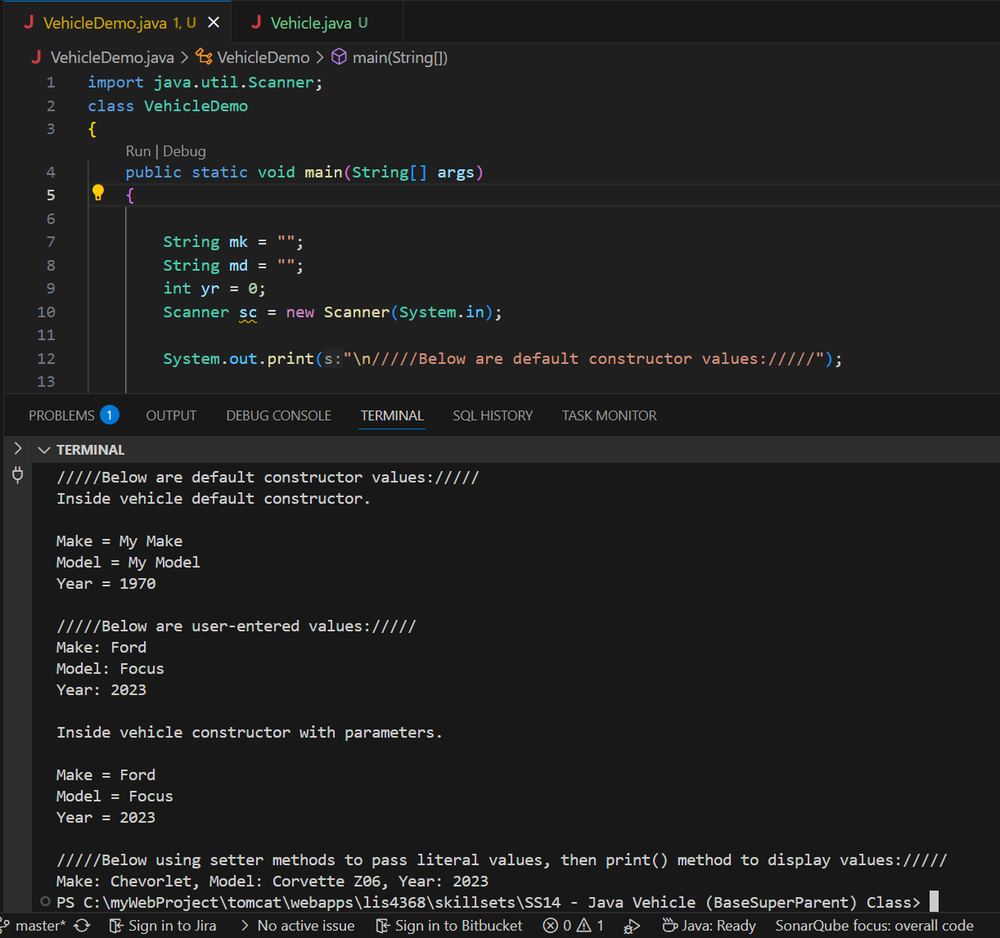
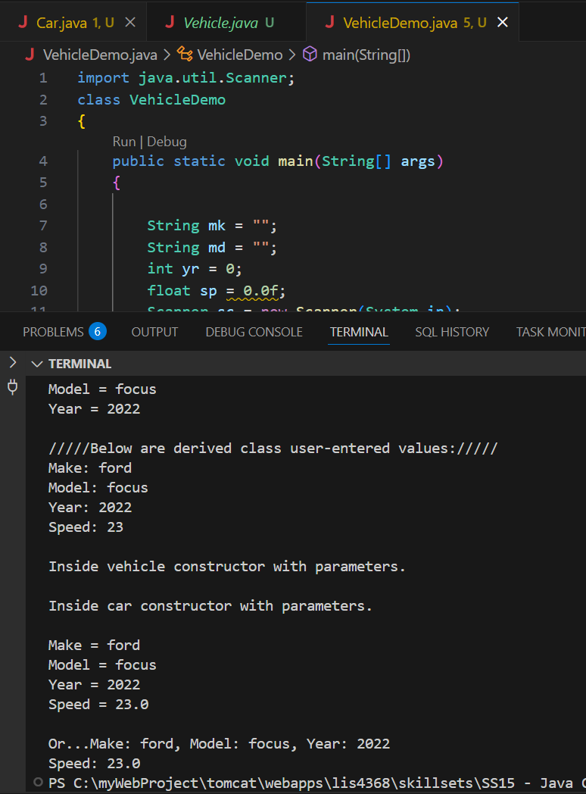

# LIS4368 Advanced Web Application Development

## Brennan O'Halloran

# Assignment 5 Requirements:

Five Parts:

1. Create and edit servlets and JSP pages
2. Screenshot of valid user entry
3. Screenshot of passed validation 
4. Screenshot of data entry
5. Complete the required skillsets

#### README.md file should include the following items:

 - Course title, your name, assignment requirements, as per A1
 - Screenshot validation on form
 - Screenshot of successful validation on form
 - Screenshot of data entry
 - Screenshot of skillset 13, 14, and 15

#### Assignment Screenshots:

*Successful User Entry Screenshot*:

*Passed Validation Screenshot*:

*Data Entry Screenshot*:

| *Screenshot skillset 13*:    |  *Screenshot of skillset 14*:   | *Screenshot skillset 15*:  |
|------------|------------|------------|
|      |  |  |

