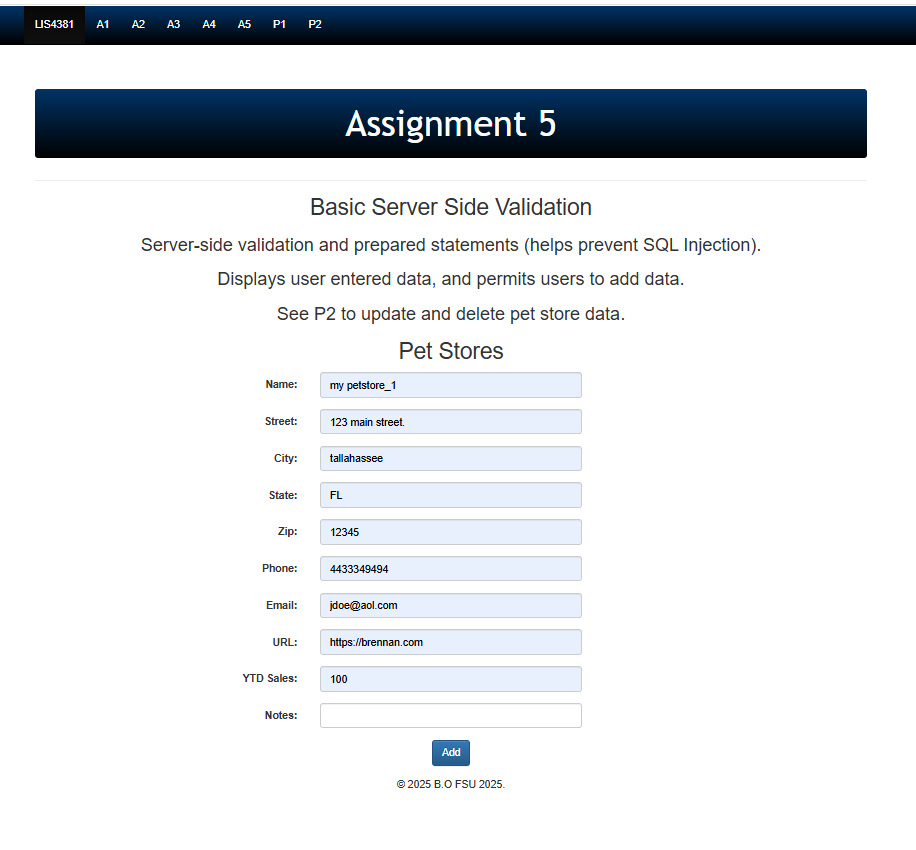
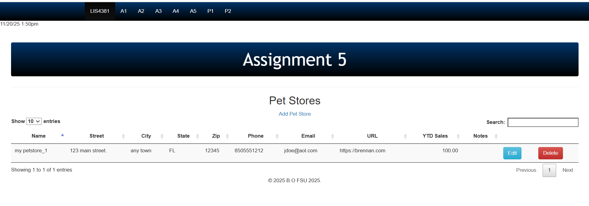
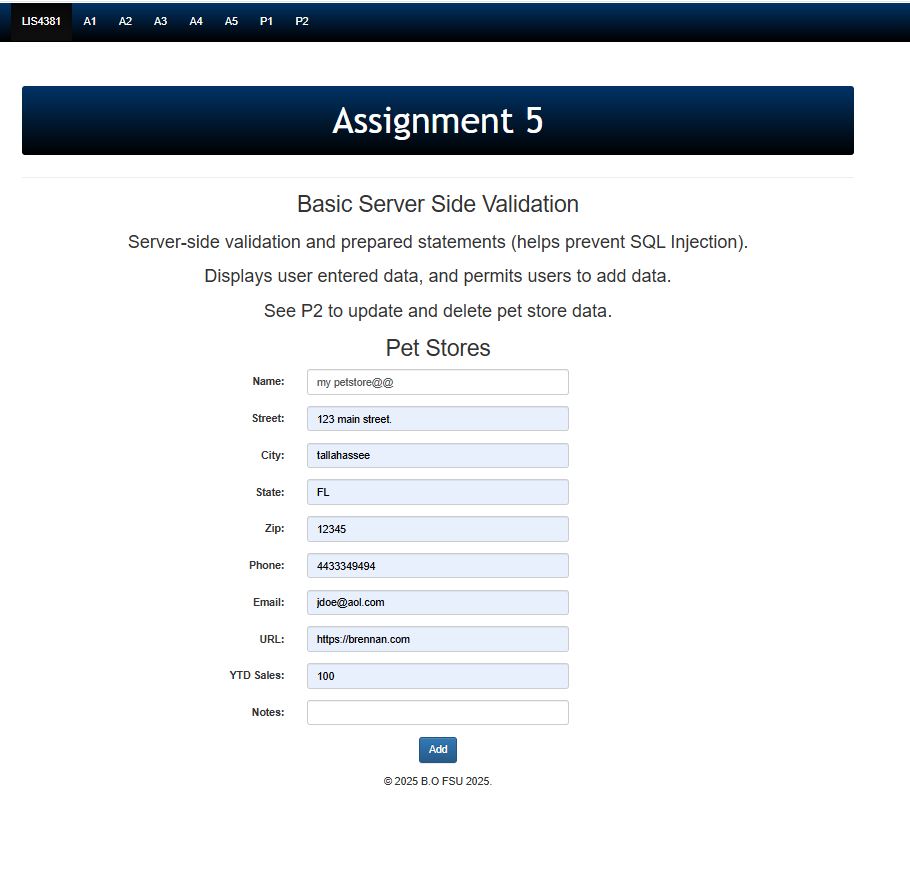
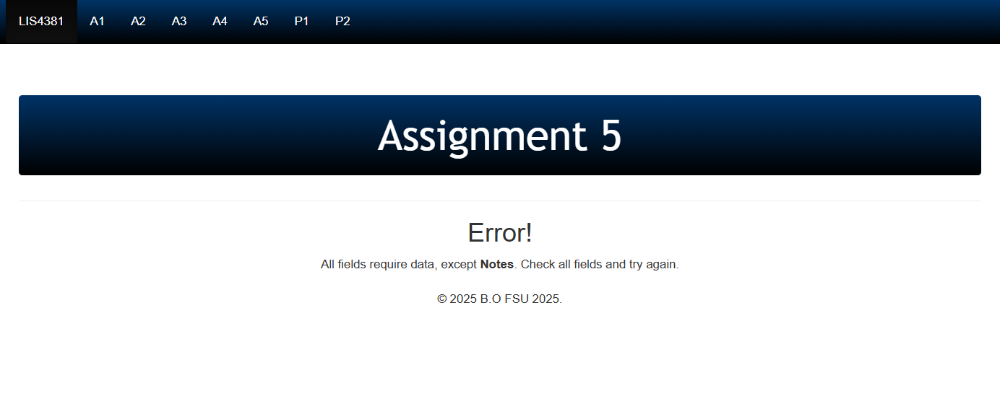
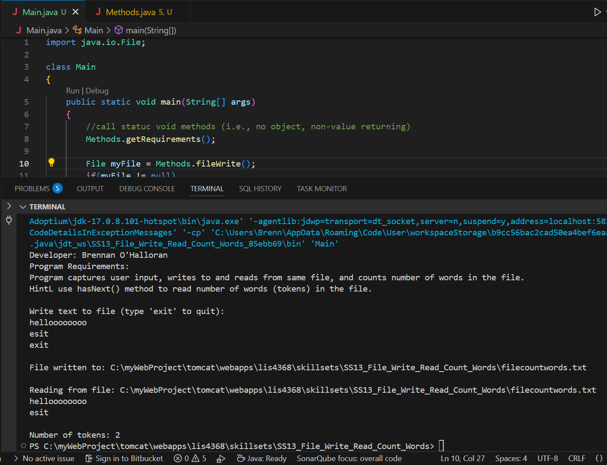
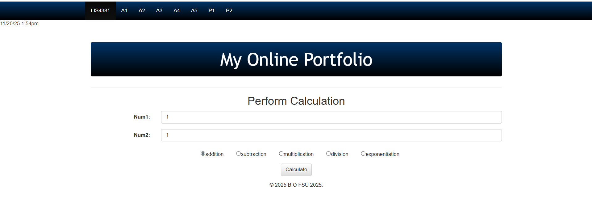
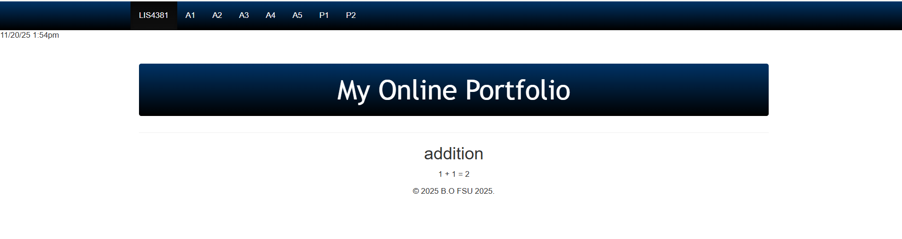
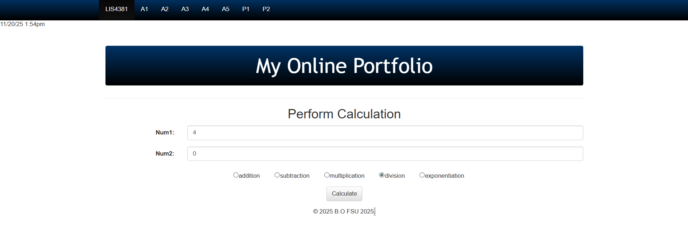
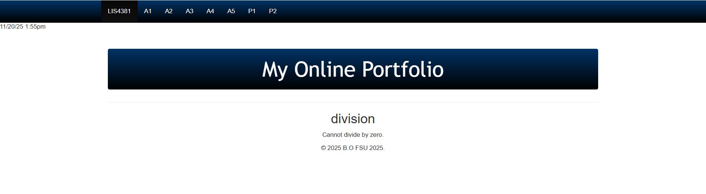

# LIS4368 Advanced Web Application Development

## Brennan O'Halloran

# Assignment 5 Requirements:

Five Parts:

1. Create and edit servlets and JSP pages
2. Screenshot of valid user entry
3. Screenshot of passed validation 
4. Screenshot of data entry
5. Complete the required skillsets

#### README.md file should include the following items:

 - Course title, your name, assignment requirements, as per A1
 - Screenshot validation on form
 - Screenshot of successful validation on form
 - Screenshot of data entry
 - Screenshot of skillset 13, 14, and 15

#### Assignment Screenshots:

*Successful User Entry Screenshot*:

*Passed Validation Screenshot*:

*Failed User Entry Screenshot*:

*Failed Validation Screenshot*:

## Skillset 13 – Sphere Volume Calculator  
[Skillset 13](../skillsets/ss13_Sphere_Volume_Calculator "Open Skillset 13 folder")

| Screenshot |
|-----------|
|  |

---

## Skillset 14 – Simple Calculator  
[Skillset 14](../skillsets/simple_calculator "Open Skillset 14 folder")

| Screenshot 1 | Screenshot 2 |
|--------------|--------------|
|  |  |

---

## Skillset 15 – Read/Write File  
[Skillset 15](../skillsets/read_write_file "Open Skillset 15 folder")

| Screenshot 1 | Screenshot 2 |
|--------------|--------------|
|  |  |

