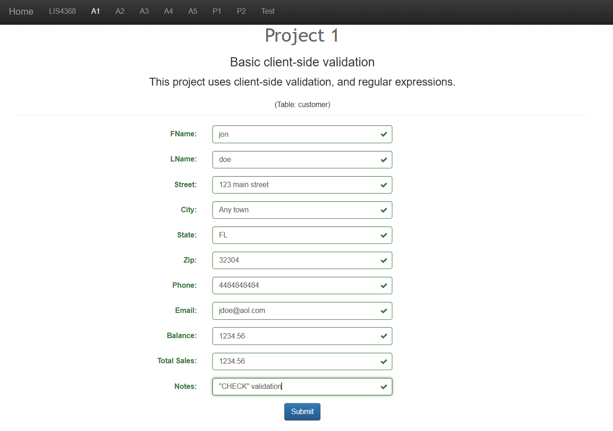
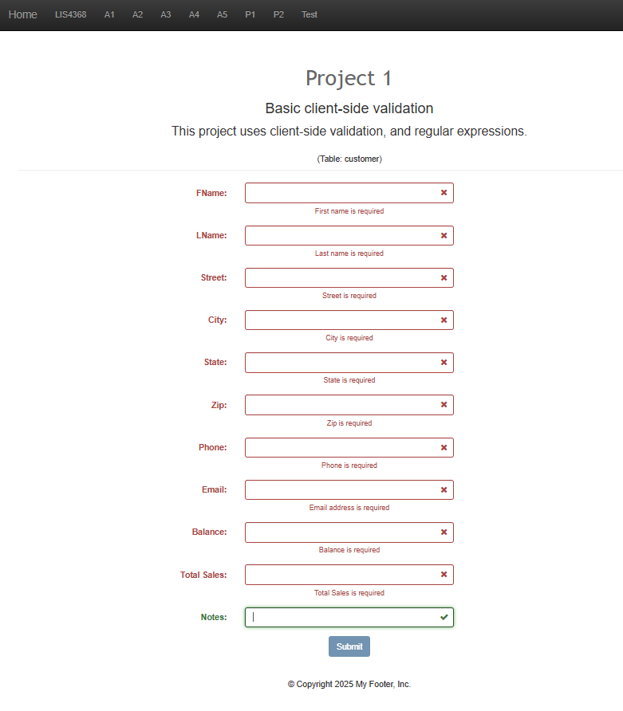

# LIS4368 Advanced Web Application Development

## Brennan O'Halloran

# Project 1 Requirements:

Three Parts:

1. Screenshot of failed validation on form
2. Screenshot of successful validation on form
3. Complete the required skillsets

#### README.md file should include the following items:

 - Course title, your name, assignment requirements, as per A1;
 - Screenshot failed validation on form;
 - Screenshot of successful validation on form;
 - Screenshot of skillset 7, 8, and 9;

#### Assignment Screenshots:

*Successful Validation Screenshot*:

*Failed Validation Screenshot*:

| *Screenshot skillset 7*:    |  *Screenshot of skillset 8*:   | *Screenshot skillset 9*:  |
|------------|------------|------------|
|      |  |  |

