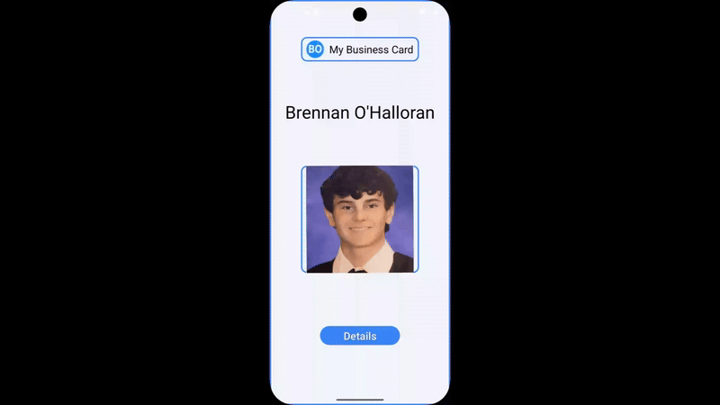
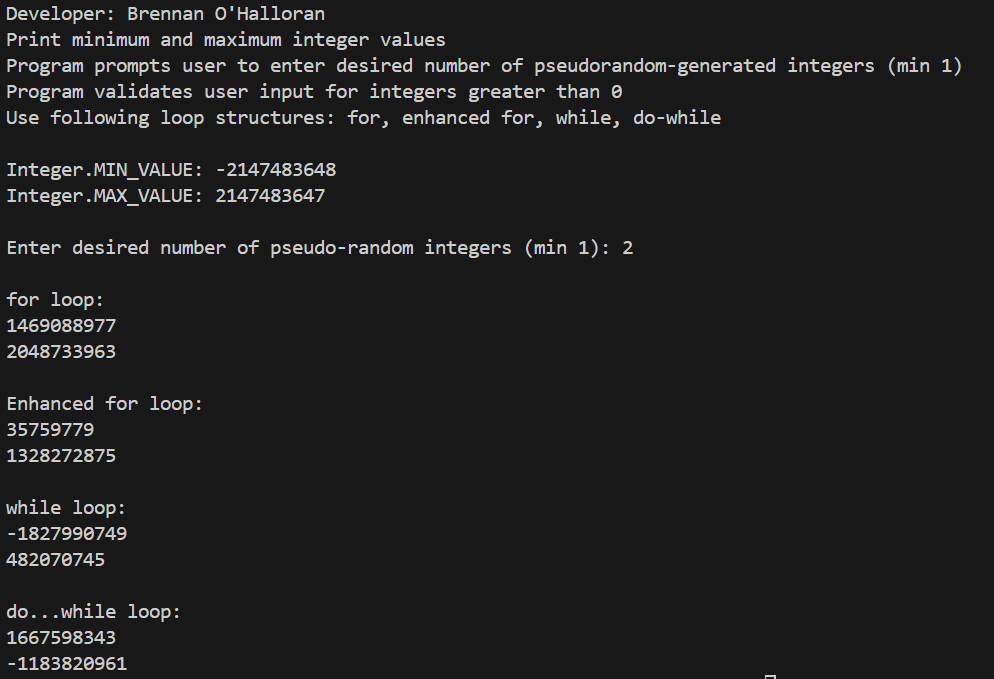
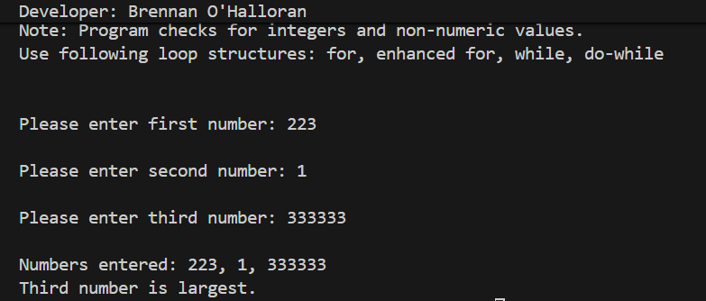
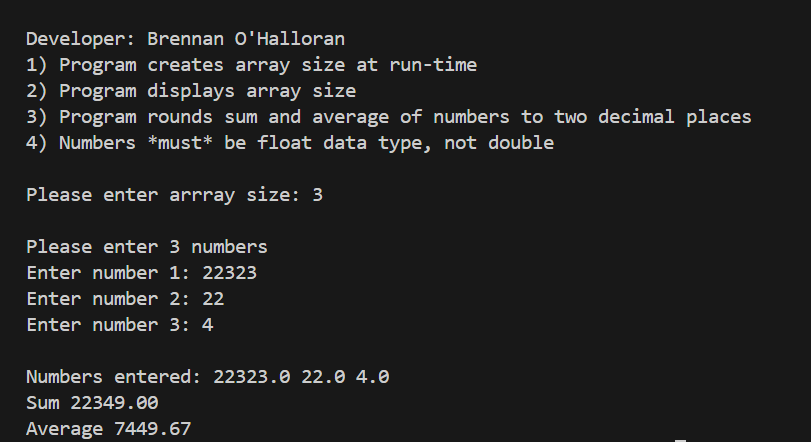

# LIS4381 Mobile Web Application Development

## Brennan O'Halloran

# Project 1 Requirements:

Three Parts:

1. Create the mobile web app
2. Include screenshot/gif of mobile app
3. Complete the required skillsets

#### README.md file should include the following items:
- Course title, your name, assignment requirements, as per A1;
- Screenshot of running application’s first user interface;
- Screenshot of running application’s second user interface;

#### Assignment Screenshots:

| **Screenshot of running application’s user interface*:    |
|-------------------------------------|
|   

| [Skillset 7](../skillsets/ss7_Random_Number_Generator_Data_Validation/ "Open Skillset 7 folder") | [Skillset 8](../skillsets/ss8_LargetThreeNumbers/ "Open Skillset 8 folder") | [Skillset 9](../skillsets/ss9_Array_Runtime_Data_Validation/ "Open Skillset 9 folder") |
|------------|------------|------------|
|  |  |  |

