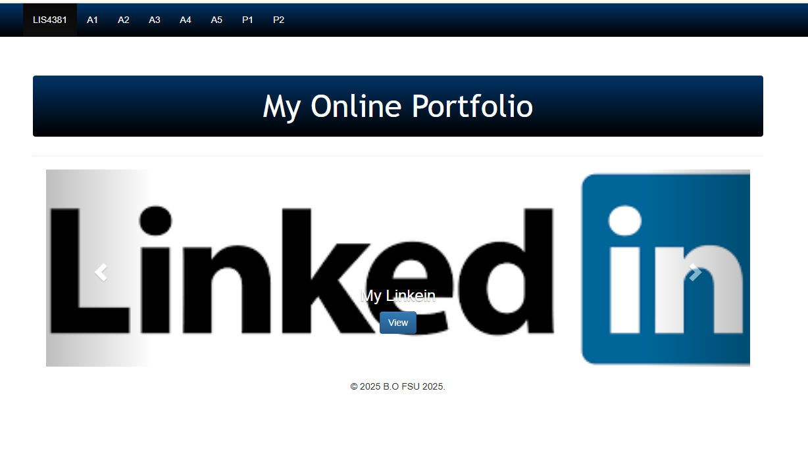
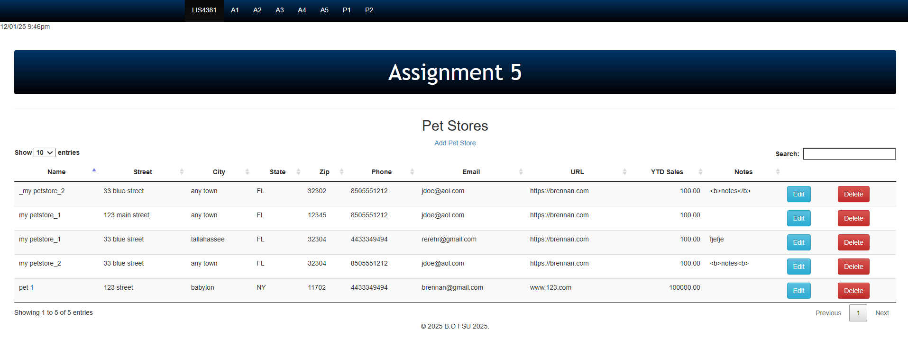
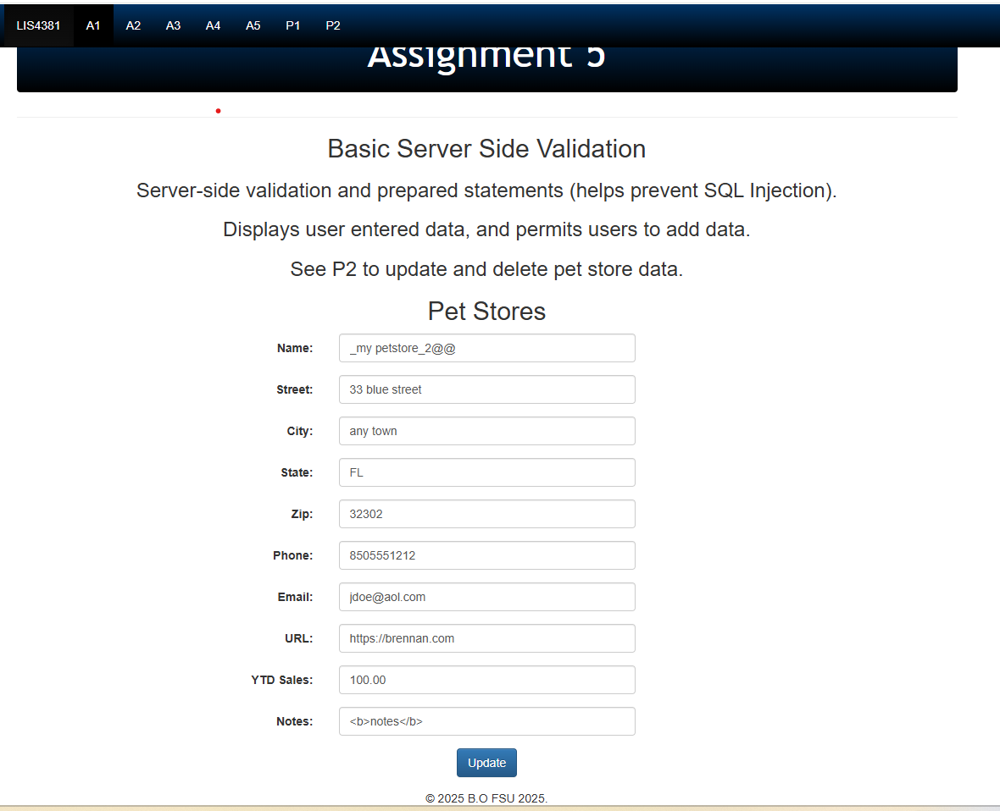
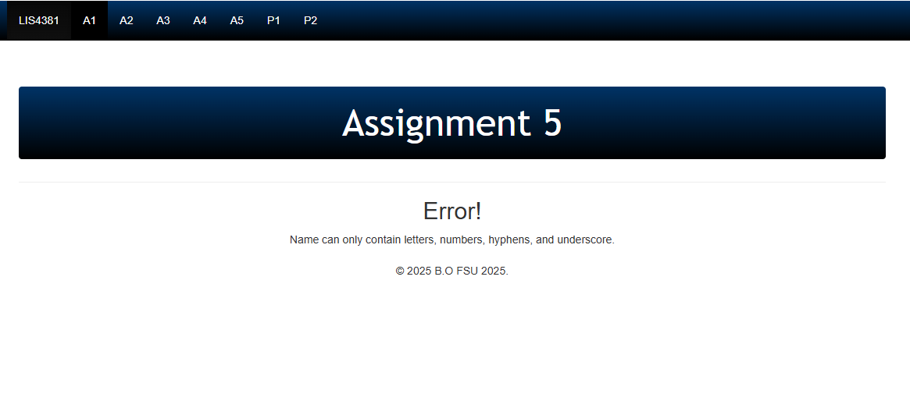
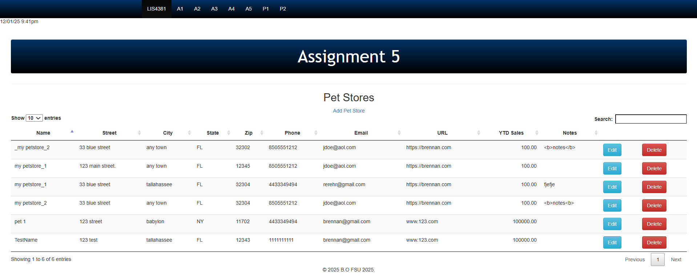
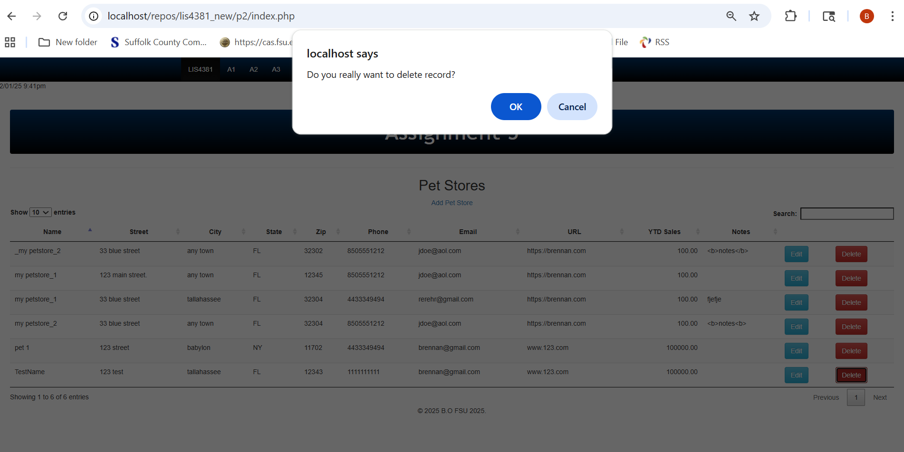
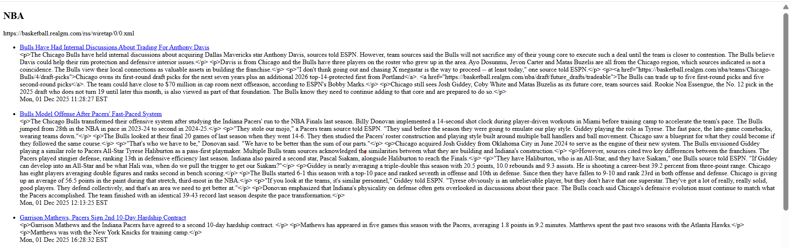

# LIS4368 Advanced Web Application Development

## Brennan O'Halloran

# Project 2 Requirements:

Four Parts:

1. Create and edit data edit files
2. Create and edit data delete files
3. Take and implement screenshots
4. Create RSS feed

#### README.md file should include the following items:

 - Course title, your name, assignment requirements, as per A1
 - Screenshot of home page  
 - Screenshot of p2 index.php
 - Screenshot of edit petstore
 - Screenshot of failed validation
 - Screenshot of passed validation
 - Screenshot of delete record prompt
 - Screenshot of deleted record
 - Screenshot of RSS feed

#### Assignment Screenshots:

*Home Page Screenshot Screenshot*:

*P2 Index Screenshot*:

*Edit Petstore Screenshot*:

*Failed Validation Screenshot*:

*Passed Validation Screenshot*:

*Delete Prompt Screenshot*:

*Successfully Deleted Record Screenshot*:

*RSS Feed Screenshot*:

